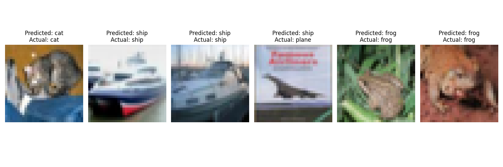
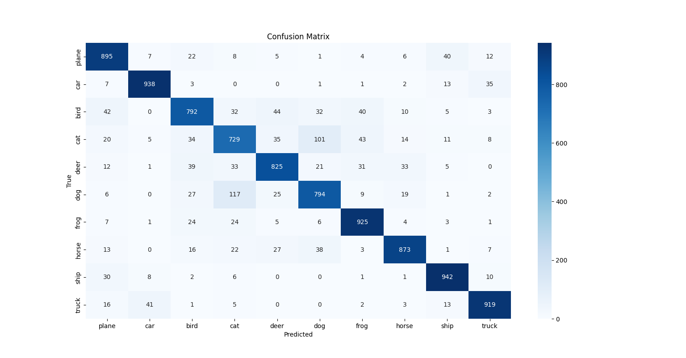
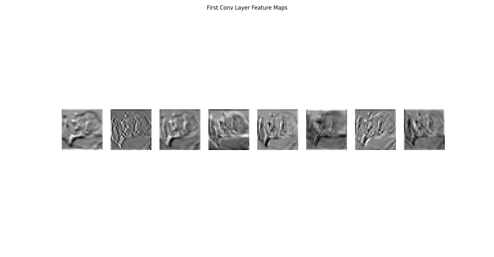

# CIFAR-10 Image Classification using a Custom CNN

This project implements a Convolutional Neural Network (CNN) from scratch
using PyTorch to perform image classification on the CIFAR-10 dataset.

The goal of this project is to understand and implement the complete
deep learning pipeline including data preprocessing, model design,
training, evaluation, and visualization.

---

## Dataset
- CIFAR-10
- 60,000 RGB images (32×32)
- 10 object classes:
  airplane, automobile, bird, cat, deer, dog, frog, horse, ship, truck

---

## Model Architecture
- Custom CNN built using PyTorch
- Three convolutional blocks with:
  - Convolution
  - Batch Normalization
  - ReLU activation
  - Max Pooling
- Fully connected layers with Dropout for regularization

---

## Training Details
- Optimizer: Adam
- Loss Function: CrossEntropyLoss
- Data Augmentation:
  - Random horizontal flip
  - Random crop with padding
- Learning rate scheduling using StepLR

---

## Results
- Test accuracy: ~85%
- Performance evaluated using:
  - Accuracy score
  - Confusion matrix
  - Feature map visualization

---

## Sample Predictions
Below are example predictions made by the trained model on unseen test images.
Each image shows the predicted class and the ground truth label.



---

## Confusion Matrix
The confusion matrix below illustrates class-wise prediction performance.



---

## Feature Map Visualization
Visualization of feature maps from the first convolutional layer,
demonstrating learned edge and texture detectors.



---

## How to Run
```bash
pip install -r requirements.txt
python test.py
